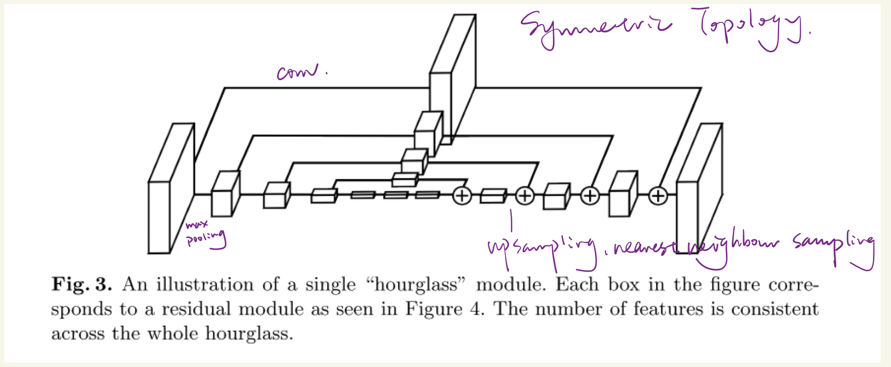
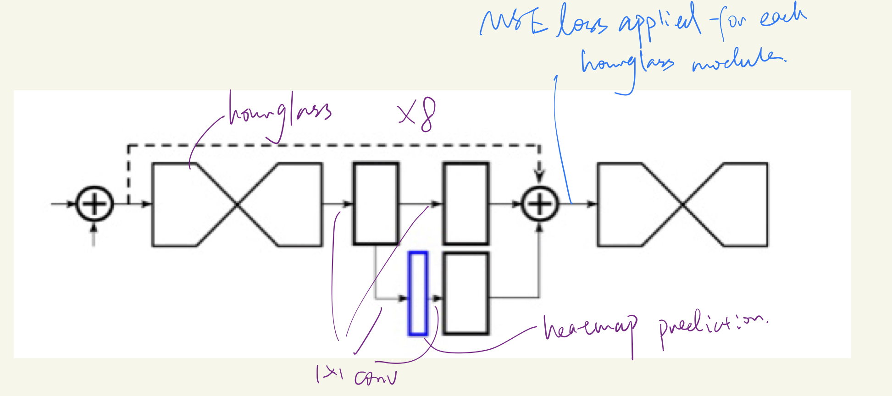
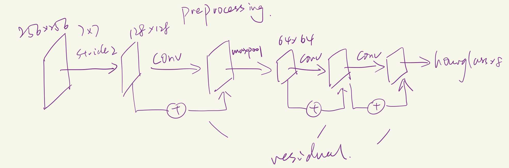

# Stacked Hourglass Networks for Human Pose Estimation

### *Alejandro Newell, Kaiyu Yang, and Jia Deng*

## 1. Introduction

+ The network captures and consolidated information across all scales of the image

+ Symmetric topology
+ repeated bottom-up, top-down inference across scales

## 2. Network Architecture

+ motivation: capture information at every scale

+ output: pixelwise predictions

+ Highlevel architecture: single pipeline with skip layers to preserve spatial information at each resolution

+ multiple hour glass modules stacked together: reevaluation of initial estimates and features across the whole image; predictions generated after being processed in the context of both local and global

+ Intermediate supervision:

  ​	considering the limit of using only using a single hourglass module

  + Supervise before upsampling: feature maps represent global feature, cannot be evaluated relative to each other
  + supervise in the early layers: local receptive field, ignorant to global cues
  + Repeated bottom-up, top-down inference with stacked hourglasses allow local and global cues to be **integrated** within each hourglass module

